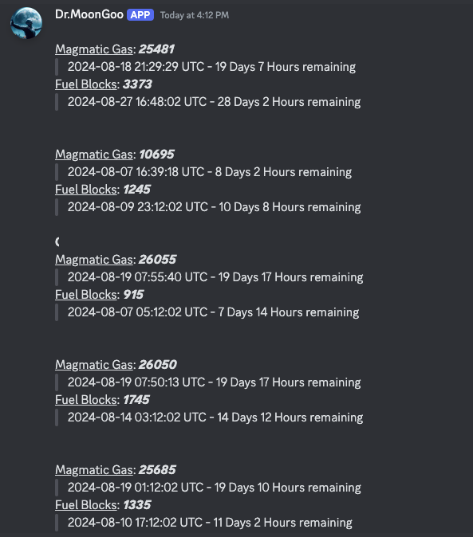

[](https://github.com/DrDeef/Dr.MoonGoo/actions/workflows/docker-image.yml)   

# If you like Moons and Goo, i have a solution for you!


## What is Dr. MoonGoo?
> A Discord bot that integrates with the EVE Online API to monitor moon drilling structures.

## Invite the Bot to your server

https://discord.com/oauth2/authorize?client_id=1242230305541197864


## Features

- **OAuth2 Authentication**: Securely authenticate with the EVE Online API.
- **Structure Monitoring**: Track and check conditions of EVE Online structures.
- **Market Calculation**: Dr.Moongoo will calculate the price of the materials in all or the selected structure
- **Goo-Alert**: Set a channel to check for Gas and Fuel levels every hour and alerts you if it falls short.
  - An alert will be send 48 Hours and 24 Hours in regards of the depletion of the Gas / Fuel
- **Gas Check**: Monitor gas levels in moon drilling structures and receive alerts if gas is low.
- **Goo Check**: Print out the amount of materials the drill has accumulated until now.


## Getting started

- !authenticate: Authenticate yourself against the ESI
- !updatemoondrills: Fetch the latest structures in your corporations
- !checkGoo: Prints out the current Goo Status of your strucutres
- !report: Select the station you want a report with price calculation
- !selectalertchannel: Select the channel you wanna be alerted to...

## Standalone Setup

### Dockerfile

There are two ways, you can either use one of the following images:
https://hub.docker.com/r/drdeef/drmoongoo/tags

Or you build your Dockerimage yourself with the `Dockerfile`

Run the Container with:

```bash
docker run -d -p 5005:5005 -v /path/to/local/config.yaml:/usr/src/app/config.yaml drdeef/drmoongoo:0.5
```

### Without Docker

1. **Clone the Repository:**

```sh
   git clone https://github.com/DrDeef/Dr.MoonGoo.git
   cd Dr.MoonGoo
```

2. **Create and Activate Virtual Environment**

```bash
   python3 -m venv venv
   source venv/bin/activate
```

3. **Install Dependencies:**

```bash
   pip install -r requirements.txt
```
4. **Run the Bot:**

```bash
   python bot.py
```


## Standalone configuration:

1. **Eve Online Scopes**

You need to generate your API ID/KEY pair here: https://developers.eveonline.com/applications
Give it the following scopes:

```bash
- esi-search.search_structures.v1
- esi-universe.read_structures.v1
- esi-assets.read_assets.v1
- esi-corporations.read_structures.v1
- esi-assets.read_corporation_assets.v1
- publicData
```

2. **Discord application**

Register your application here: https://discord.com/developers/applications
Navigate to Applications > Bot

Give it following Parameters:
```bash
Message Content Intent.

Permission Integer
- 517544037440
```

3. **configure the bot**

Update the config.yaml to your needs:

```bash
discord_bot_token: YOUR_DISCORD_BOT_TOKEN
eve_online_callback_url: http://localhost:5005/oauth-callback
eve_online_client_id: YOUR_EVE_ONLINE_CLIENT_ID
eve_online_secret_key: YOUR_EVE_ONLINE_SECRET_KEY
```

## Market Calculation
**Thanks to [Janice](https://janice.e-351.com) for the API Key**

- Calculation is done every 6 hours but updated when changes are detected
- Pricing Calculation will be done with the Jita Buy / Sell (Immediate)


## Magmatic Gas & Fuelblock Calculation

Calculation is based on ingame values

- Magmatic Gas: 1 Hour = 110 Units
- Fuel Blocks: 1 Hour = 5 Blocks


## Example Bot Response
> !report


> !checkGas



> !checkGoo


## Example Bot Alert:

**Structure Name**: Magmatic Gas is running **low!**<br>
Magmatic Gas: ***440*** <br>
Gas runs out in: **0 Days 8 Hours**

## Commands

- **!authenticate**: Authenticate the bot against the EvE Online ESI API
  - You need e.g. Director permissions ingame to check the structural assets
- **!getMeGoo**: Will Setup basic parameters
- **!updatemoondrills**: Update your Moondrill Structures
- **!checkGoo**: Print out every Asset within your Metenox Moon Drills.
- **!checkGas**: Prints the amount of Magmatic Gas and Fuel Blocks within the Moondrill with a timer
- **!selectalertchannel**: Select the channel you wanna be alerted to.
- **!spacegoblin**: Guess who is a good spacegoblin?

## Presented by Mem3nto Mori & Regnum Astera

[](https://discord.gg/kU3EsHnjVc)[](https://discord.gg/uPkd893FZV)

If you’re looking for a strong and dedicated EVE Online alliance to join, consider **Regnum Astera**!
Join us and be part of something epic!

For more information reach out to us directly on [Discord](https://discord.gg/uPkd893FZV)

Happy Mooning! 🚀

## Donate

If you like the Bot, please consider donating ISK ingame to [Ralon Borio](https://evewho.com/character/1586742899)

## Terms<a name="terms"></a>

> **This is an open-source project without any guarantees. Use it at your own risk.**

## Contributing<a name="contribute"></a>

Contributions are welcome! If you would like to contribute to this project and optimize the code, follow these steps:

1. Fork the repository by clicking on the "Fork" button at the top right corner of this page.
1. Clone your forked repository to your local machine.
1. Make the necessary changes and improvements to the code.
1. Commit your changes and push them to your forked repository.
1. Submit a pull request by clicking on the "New pull request" button on the original repository's page.

Please ensure that your contributions adhere to the following guidelines:

- Follow the existing code style and conventions.
- Clearly describe the changes you have made in your pull request.
- Test your changes thoroughly before submitting the pull request.

By contributing to this project, you agree to release your contributions under the MIT License.
